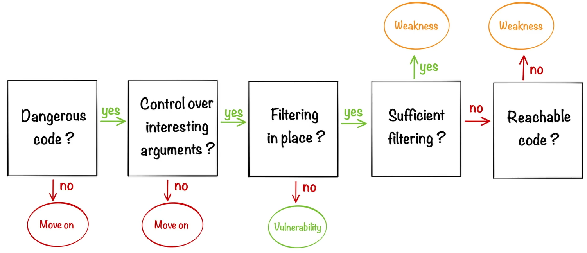

# Code-Review
It best to start code review with 1 specific function of the application
## Routing
How you map 1 function to a code/object
## Reviewing process

It important when reviewing code to remember REPL (Read, Evaluate, Print, Loops)

# Coding AI
[V0](https://v0.dev/)
[Cursor](https://www.cursor.com/)
